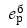

import fKEOImage from "@site/docs/resources/frame/fKEO.png";

***

**Нормативная документация:**

- **СП 52.13330.2016 «Естественное и искусственное освещение»**   
- *Изменение № 1 к СП 52.13330.2016 от 20 ноября 2019г.*  
- *Изменение № 2 к СП 52.13330.2016 от 28 декабря 2021г.*  
- **СП 367.1325800.2017 «Здания жилые и общественные. Правила проектирования естественного и совмещенного освещения»**  
- *Изменение № 1 к СП 367.1325800.2017 от 14 декабря 2020г.*
- *Изменение № 2 к СП 367.1325800.2017 от 20 декабря 2022г.*
- **СанПиН 1.2.3685-21 «Гигиенические нормативы и требования к обеспечению безопасности и(или) безвредности для человека факторов среды обитания»**

Положение расчетных точек КЕО определяется в соответствии с СП 52.13330.2016. 
Расчетные точки КЕО создаются автоматически, но также можно определить их в любом произвольном месте, заданном пользователем. 

Расчет производится по СП 367.1325800.2017 для облачного неба МКО.

### Расчет геометрического КЕО с учетом неравномерной яркости облачного неба 
На первом этапе программа выполняет расчет геометрического КЕО.

_**Определение света неба и отраженного света:**_

1. Небосвод разбивается на одинаковые равносторонние фигуры. Через светопроем комнаты от расчетной точки до небосвода пускаются лучи. Размеры освещаемого участка зависят от затенения откосами. 

2. На небосводе отображаются участки освещенности (прямого и отраженного света).

3. Находятся точки пересечения лучей с гранями объектов сцены. Если пересечений нет, то считается, что точка освещена участком неба (с учетом яркости неба МКО или небом неравномерной яркости). Если пересечение есть, то считается, что участок неба закрыт гранью объекта. 

4. Из всех точек пересечения луча с гранями объектов выбирается ближайшая, так как расчетная точка освещается отраженным светом от ближайшей к ней грани. Яркость этой грани принимается равной единице. 

5. После расчета всех лучей результаты суммируются отдельно для неба и отдельно для каждой из граней. 

В случае если луч пересекает грань парапета или крыши, то вместо этого считается, что луч пересекает грань здания, что соответствует методике из СП367.1325800.2017. Суммарная освещенность, полученная для неба, делится на освещенность, даваемую полной полусферой небосвода (с учетом яркости неба МКО и для неба неравномерной яркости). В результате получается значение геометрического КЕО для неба МКО и для неба равномерной яркости. 

При определении КЕО видимого участка небосвода используется значение геометрического КЕО с учетом яркости неба МКО. Для граней суммарные результаты делятся на освещенность, даваемую полной полусферой небосвода с яркостью равной единице.  

### Расчет аналитического КЕО

На втором этапе расчета программа определяет расчетное значение КЕО. 

_**Для каждого экранирующего здания:**_ 

- определяется схема застройки и приводится к эквивалентной схеме с параллельным расположением зданий (по методике из СП367.1325800.2017, но каждое окно рассчитывается отдельно); 
- определяются коэффициенты для каждого фасада каждого здания – бф и Кзд; 
- полученные коэффициенты учитываются для каждого участка фасадов здания.

Полученные значения по каждому участку фасадов и каждому участку неба суммируются, к этой сумме прибавляется геометрический КЕО неба с учетом неравномерной яркости. Для каждого окна: 

- учитывается общий коэффициент светопропускания (он вычисляется по свойствам окна) и коэффициент потери света в архитектурных элементах фасадов зданий, 
- учитывается коэффициент, повышающий КЕО благодаря свету, отраженному от поверхности помещения и от подстилающего слоя, прилегающего к зданию (этот коэффициент вычисляется на основе свойств комнаты).

Расчетное значение КЕО для каждого окна в помещении складывается.

Нормируемое значение КЕО определяется в зависимости от коэффициента светового климата (он зависит от того, в каком административном районе расположен объект) и от ориентации световых проемов по сторонам горизонта.

###  Методика расчета КЕО в программе 
Расчет КЕО производится для комнат произвольной формы. 

Положение точек КЕО, которые устанавливаются программой автоматически: 

- Определяется в соответствии с СП 52.13330.2016, СанПиН 1.2.3685-21;  
- Зависит от значения свойства комнаты «Тип помещения»;
- Создается в геометрическом центре помещения или на расстоянии 1 м от поверхности стены, противостоящей боковому светопроему, на уровне пола этажа или на уровне 0,8 м от него 
(рабочая плоскость) в зависимости от назначения помещения.

При двухстороннем боковом освещении помещений любого назначения ставится одна точка КЕО в центре помещения на пересечении вертикальной плоскости характерного разреза и рабочей поверхности. (п. 5.3 СП 52.13330.2016). 

Положение точки в помещении с простой и сложной конфигурацией.

В случае с простой геометрией помещения (квадратной, прямоугольной) поиск точки происходит соответственно стандартному алгоритму:

- Определяется центральная ось помещения между внутренними стенами, вдоль которой будет находиться расчетная точка;
- От стены противоположной световому проему, откладывается расстояние согласно п.5.3 СП 52.13330.2016 «Естественное и искусственное освещение»;
- Высота расчетной точки задается согласно т. 5.54 СанПиН 1.2. 3685-21 «Гигиенические нормативы и требования к обеспечению безопасности и (или) безвредности для человека факторов среды обитания».

При сложной конфигурации помещения следует придерживаться правил, закрепленных в п. 5.3а СП 52.13330.2016 Изм. 1, Изм. 2:

- Положение расчетной точки определяется с учетом приведения формы помещения к прямоугольнику;
- В расчетах КЕО следует использовать эквивалентную глубину помещения, которая откладывается на характерном разрезе от центра светопроема;
- Под эквивалентной глубиной помещения принимается отношение площади к ширине помещения;
- Если характерный разрез (ХР) не совпадает с центром светопроема, то находится геометрический центр помещения, и ХР проходит через него.

Для произвольных комнат пользователь может создать точки КЕО в любом месте пространства комнаты и вне ее. 

Характерный разрез помещения (ХРП) считается перпендикулярным плоскости остекления рассчитываемого окна комнаты и проходящим через середину проекции комнаты на плоскость остекления этого окна. Противоположная стена для одного или нескольких окон в одной плоскости — это стена, которая пересекает ХРП и точка пересечения которой с ХРП наиболее удалена от данных окон комнаты. Центр помещения — центр помещения на характерном разрезе помещения (середина проекции контура помещения на характерный разрез помещения). 

При расчете КЕО в непрямоугольных комнатах применяются следующие правила определения характеристик прямоугольного помещения:  

- Направление на горизонтальной плоскости выбирается на основе светопроемов. Светопроемы группируются по направлениям: та группа, в которой больше всего светопроемов, считается доминирующей. Она берется за основополагающую.
- Строится ориентированный на выбранную сторону ограничивающий прямоугольник со сторонами параллельными и перпендикулярными оси оконного проема, который полностью содержит в себе комнату. 

Если характерный разрез не совпадает с центром светопроема (в случае сложной конфигурации помещения), то находится геометрический центр помещения, и характерный разрез проходит через найденный центр помещения.

В программе реализован расчет КЕО при боковом освещении по формуле 3.11 Изменение № 1 к СП 367.1325800.2017 от 14 декабря 2020г. 

<image image={fKEOImage} width="70%" title="Формула для расчета КЕО"/>

где  
— расчетное значение КЕО, 

- **CN** — коэффициент светового климата, определяется по таблице 5.1 СП 52.13330.2016. В зависимости от ориентации световых проемов по сторонам горизонта и коэффициента светового климата (который определяется в зависимости от административного района). Если освещение не является односторонним (окна ориентированы на разные стороны горизонта), то при вычислении используется среднее арифметического значение светового климата для каждого светопроема. 
- **Ɛƃj** — геометрический КЕО в расчетной точке, учитывающий прямой свет от i-го участка неба, 
- **q(γ)** — коэффициент, учитывающий неравномерную яркость i-го участка облачного неба МКО, 
- **Ɛздj** — геометрический КЕО, учитывающий свет, отраженный от j-го участка фасадов противостоящих зданий, 
- **bФj** — средняя относительная яркость j-го участка фасадов зданий противостоящей застройки, 
- **Кздj** — коэффициент, учитывающий изменения внутренней отраженной составляющей КЕО в помещении при наличии противостоящих зданий, 
- **L** — число участков небосвода, видимых через световой проем из расчетной точки, 
- **M** — число участков фасадов зданий противостоящей застройки, видимых через световой проем из расчетной точки,
- **r0** — коэффициент, учитывающий повышение КЕО благодаря свету, отраженному от поверхностей помещения и подстилающего слоя, прилегающего к зданию, 
- **Ƭ0** — общий коэффициент пропускания света, 
- **К** — коэффициент, учитывающий потери света в архитектурных элементах фасадов зданий,
- **MF** — коэффициент эксплуатации. MF=1/K3, где Кз — коэффициент запаса (данный коэффициент устарел и не используется). 

Значение коэффициента MF домножается на 0,91 или 1,11 в зависимости от выбранного типа стекла (примечание 1 к таблице 4.3 СП 52.13330.2016). 
Коэффициент "Тип стекла" задается в свойствах светопроема. 

При наличии в помещении балкона, лоджии, горизонтального козырька и вертикального экрана проверочный расчет выполняют так же, как и для помещений без подобных конструкций, а их наличие учитывают понижающим коэффициентом К. 

Применение понижающего коэффициента К (учитывающего потери света в архитектурных элементах фасадов зданий) закреплено в СП 52.13330.2016 Изм. 2 и СП 367.1325800.2017 Изм.1. 

Величина коэффициента определяется в соответствии с таблицами А10а-А10г СП 367.1325800.2017 Изм.1. Его значение напрямую зависит от глубины помещения и положения точки нормирования.

В сервисе коэффициент К определяется автоматически исходя из наличия балконов, лоджий, горизонтальных козырьков и вертикальных экранов. В случае их отсутствия величина К равна 1. 

При расчете КЕО учитываются не только противолежащие затеняющие здания, но и конструкции расчетной модели здания, например, входная группа, выступы здания и т.д. 
