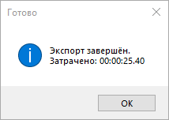

import rvImage2 from "../resources/AVT.png";

***

## Установка плагина

Для расчета инсоляции в AltecInsolations Вам понадобится конвертировать модель в формат glb с помощью плагина **Revit Export**. Скачать плагин можно в личном кабинете AltecSystems во вкладке *"Мои продукты"*. 


Во время установки плагина программа Revit должна быть закрыта. 

Выберите версии Revit, с которыми вы будете работать и запустите установку.

В случае, если плагин уже установлен, Вы можете обновить его до последней версии, или удалить.

Откройте модель в Revit, перейдите на вкладку *AltecSystems Exporter*. 

Для корректных расчетов необходимо, чтобы на виде отображались основные конструкции здания и другие элементы, влияющие на расчет. Экспорту подлежат только видимые элементы текущего 3D вида.

Нажмите кнопку *“Создать вид”* на верхней панели команд. В проекте появится новый вид, именуемый *”AS_Export View”* в диспетчере проекта. 

Для автоматической настройки категорий можно воспользоваться кнопкой создания преднастроенного вида *"Создать вид"* на верхней панели. После вы получите оптимально настроенный 3D вид.


**Важно:**

Оптимальная настройка уровня детализации в Revit - "Средний".
Иногда в сцене присутствуют высокодетализированные элементы (большое количество полигонов, которые могут существенно замедлить экспорт или привести к ошибкам). Такие элементы, желательно, скрыть при экспорте.

*При ручной настройке обязательными к экспорту являются:* 

```
Балочные системы
Витражные системы
Двери
Импосты витража
Каркас несущий
Колонны
Крыши
Несущие колонны
Обобщенные модели
Окна
Ограждения
Панели витража
Перекрытия
Потолки
Стены
Фермы
Части
Соединение несущих конструкций
```

Когда создан 3D вид, можно приступать к экспорту.

## Экспорт модели. Требования к ней
	
Для вызова окна авторизации нажмите на кнопку *“Экспортер”* на верхней панели команд.
Нажимаем *“Войти”*, в окне авторизации вводим электронную почту и пароль. 


После авторизации вы попадаете в окно экспорта. 

В текущем окне три вкладки: *“Экспорт”, “Аккаунт”, “Информация”*.

> **“Экспорт”**
> 
> В поле *“Имя проекта”* Вы можете задать новое имя или оставить автоматически сгенерированное из наименования файла Revit.
>
> В выпадающем списке *“Проекты на сервере”* Вы можете выбрать имеющийся проект, в таком случае модель на сервере будет заменена на текущую версию.


> **“Аккаунт”**
>
> В информации об аккаунте Вы увидите данные, введенные на этапе авторизации.

> **“Информация”**
>
> В этой вкладке содержатся сведения об используемом плагине, контактная информация о разработчике.
>
> Для выгрузки файла в AltecInsolations нажимаем кнопку *“В Insolations”* на вкладке *“Экспорт”*. 
>
> После выгрузки вы увидите уведомление *“Экспорт завершен”*.

