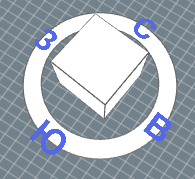
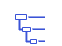
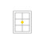

***
## Главная страница
Вы можете перейти в сервис AltecInsolations по прямой ссылке или из личного кабинета, вкладка *“Мои продукты”*.

На главной странице вы увидите тестовую модель и ранее экспортированные Вами файлы. 

Для навигации можно воспользоваться поиском по названию, выбрать удобный режим отображения: список или таблица. 


**Левая панель содержит:**


*Главная страница*


*Настройки*


*Справка*


*Личный кабинет*


При нажатии на иконку Вы можете открыть личный кабинет в новой вкладке или выйти из аккаунта.

Вы можете создать папку, используя кнопку *“Добавить папку”*. Файлы можно перемещать в папки с помощью перетаскивания или контекстного меню файла модели.

Открыть модель можно с помощью двойного клика левой кнопкой мыши (далее ЛКМ) или через контекстное меню - открыть.

## Интерфейс программы

После загрузки сцены вы увидите интерфейс, который содержит:

```
Модель в сцене
Панель инструментов (в левой части экрана)
Командная панель (в правой части экрана)
Инсоляционная линейка (в нижней части экрана).
Панель инструментов
```

В верхней части панели расположен логотип, который содержит контекстное меню данной модели.

Иконка в виде домика возвращает на главную страницу.

**Инструменты:**

 
 *Сечение* позволяет изучить модель, планировки.


 Клик по иконке *“Роза компаса”*  позволяет отключать и включать розу ветров на виде. 

 
 Вы можете выбрать режим камеры при наведении на иконку. 


**Режимы камеры:**

 *“Орто камера”*
включает ортогональный вид на модель сверху

Перемещение по сцене осуществляется с помощью зажатия колесика мыши и перемещения курсора. Для приближения - отдаления прокручиваем колесико мыши.

 *“Арк камера”* 
активирует перспективу модели

В режиме “Арк камера” в главном видовом окне вращение модели осуществляется относительно центра (положения курсора) по сфере через одновременное зажатие колёсика мыши и клавиши “Shift”. Для смещения вправо-влево необходимо зажать колёсико мыши в любой точке и осуществить перемещение.  
В правом верхнем углу видовой куб, позволяющий осуществлять навигацию по модели. Можно менять видовые кадры, кликая левой кнопкой мыши либо по сторонам света, либо по граням и ребрам куба. 



 *“Свободная камера”* 
активирует перспективу модели

Режим “Свободная камера” подразумевает возможность полёта камеры отдельно от объекта. Поворот осуществляется с помощью зажатия колесика мыши. Движение вверх-вниз, вправо-влево осуществляется с помощью клавиш управления курсором (стрелок навигации).


**Командная панель:**

Содержит вкладки:


 
Дерево объектов (открыто по умолчанию)

 
Инсоляция окон

 
КЕО

 
Инсоляция площадок

 
Шумозащита
