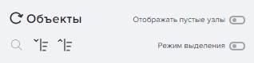

import rvImage from "../resources/rv.png";
import rvImage1 from "../resources/neopred.png";

***

Дерево объектов содержит здания, уровни (этажи), квартиры, помещения и окна. 
Панель навигации по дереву объектов включает: поиск, кнопки свернуть и развернуть все, возможность скрыть пустые узлы (помещения без квартиры) и режим выделения (не активен по умолчанию).

*Для расчета инсоляции необходимо:*
1. Активировать режим выделения
2. Выбрать объекты для расчета автоматически  или вручную, пользуясь чекбоксами в дереве объектов.

Расчетной единицей может являться здание, этаж, квартира, помещение, окно.

После того как расчетные единицы выбраны, внизу панели появляются активные кнопки *“Расчет инсоляции”* и *“Расчет КЕО”* . 

Для корректного расчета инсоляции необходимо заполнить настройки. Для этого перейдите во вкладку *“Инсоляция”*, которая содержит настройки и результаты.

**Настройки инсоляции:**

В *режиме автозаполнения* укажите местоположение, открыв карту нажатием кнопки *“Указать место”*. Данные будут заполнены автоматически.

В случае, когда местоположение не содержит данные о городе вы увидите надпись:

Заполнить это поле можно нажав на ссылку.
Последующие строки заполняются автоматически в соответствии с СанПиН 1.2.3685 - 21 «Гигиенические нормативы и требования к обеспечению безопасности и (или) безвредности для человека факторов среды обитания».
При выборе *ручного режима*, программа выдаст предупреждение:

В отчете будет пометка, о том, что данные введены произвольно и необходима их проверка на соответствие СанПиН 1.2.3685 - 21
Заполняем все поля в соответствии с нормативом, либо вводим произвольные параметры. 
В нижней части командной модели есть опция *“Возврат точки”*. При включении активируется функционал перемещения расчетной точки на подоконник при условии, что она в связи с особенностям геометрии переместилась за пределы светопроема. 

Если же мы отключаем возврат, то можем сами назначить допустимую высоту смещения точки по горизонтали. 

Высота подоконника, определяет значение, на которое можно поднимать расчетную точку относительно подоконника (метры)

Убедившись в корректности введенных настроек, возвращаемся на вкладку *“Объекты”*	
Нажимаем *“Расчет инсоляции”*. Происходит загрузка модели, ее предварительная обработка, поиск расчётных точек, инсолирование выбранных объектов. Ход расчета отображается в нижней панели.

Возвращаемся на вкладку *“Инсоляция”*, переходим в раздел *Результаты*.

На панели отображается имя здания, ниже указывается его тип жилое/общественное далее списки зданий со вложенностями. Отображается процент непрерывной инсоляции и суммарной. При нажатии на последнюю выводятся время начала инсоляции, её конец им сумма. В нижней части экрана - инсоляционная линейка, на которой эта информация выведена графически. 

Зелёным отображаются объекты прошедшие инсоляцию, красным - соответственно не прошедшие инсоляцию.

В Верхней части панели есть фильтр, позволяющий отобразить только нужные для анализа планы и фильтр в зависимости от прохождения тем или иным помещением инсоляцию.
