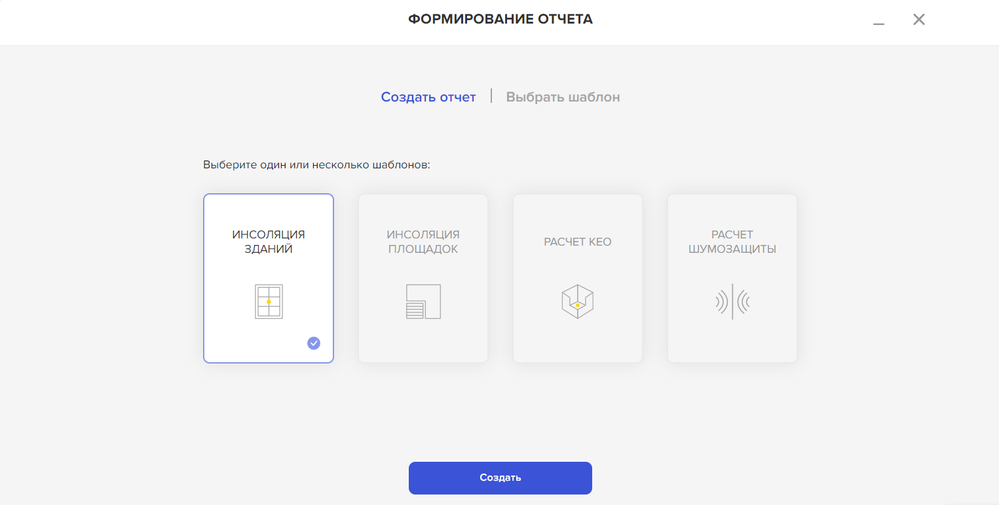

***

В нижней части панели есть кнопка, позволяющая создать отчёт. Нажимаем. Появляется окно *“Формирование отчёта”*. Нам предлагается создать отчет по шаблону выбираем *“Инсоляция зданий”*. Нажимаем *“Создать”*

 ### 1 ШАГ

Заполняем строку *“Заголовок отчета”*
Вводим данные штампа. Есть возможность его редактирования путем добавления и удаления строк. Нажимаем *“Продолжить”*

### 2 ШАГ

Заполняем поле *“Введение”*. Текст можно сохранить как шаблон и использовать в последующих версиях отчета для текущей модели.

Далее описана методика расчета. Информация об исходных данных генерируется автоматически, изменить её можно в командном меню в разделе *“Настройки”*. Обновление настроек повлечет изменение результатов инсоляции в отчёте.

###  3 ШАГ

На этом этапе Вы выбираете необходимые для отчета этажи с помощью фильтра.

### 4 ШАГ

Заполняем поле *“Вывод”*. Текст можно сохранить как шаблон и использовать в последующих версиях отчета для текущей модели.

### 5 ШАГ

В автоматически сформированном списке объектов из файла RVT выбираем здание. Далее выбираем этаж, либо группу этажей, для которых необходимо сгенерировать сечение. 

Ставим галочку в пункте *"Прикрепить сечение"*
Нажимаем *“Добавить файл”*.

Справа появляется панель.

Планы БТИ необходимо выгрузить самостоятельно, с помощью кнопки *“Выбрать файлы”*, либо просто перетащив их в выделенное поле.

Затем нажимаем
*"Загрузить выбранные файлы"*.

Кнопка "Добавить" позволяет вернуться назад и дополнить приложение планами БТИ. 

Кнопка "Прикрепить" формирует список приложений.

Внизу списка приложений кнопка *"Добавить приложение"*.

С её помощью, при необходимости, можно выбрать другое здание из сборки и подгрузить относящиеся к нему сечения, по тому же алгоритму.

### 6 ШАГ

Ваш отчёт готов! На этом этапе доступно превью всего отчета, его можно сохранить для редактирования в сервисе. 

Отчет можно сохранить в PDF. Файл будет скачан и заверен электронной подписью, без дальнейшей возможности редактирования.

