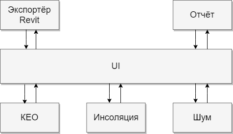

import fKEOImage from "@site/docs/resources/frame/fKEO.png";

***

## 1. Возможности комплекса 

**Программа Altec Insolations предоставляет возможность выполнить следующие виды расчетов:**
- *расчёт продолжительности инсоляции;* 
- *расчёт КЕО; (в разработке)*
- *расчёт шумозащиты; (в разработке)*

## 2. Общая схема функционирования ПК Altec Insolations

Программа Altec Insolations предназначена для расчета, исследования инсоляции помещений жилых и общественных зданий и территорий, определения КЕО и их шумозащиты.

Основной графической системой является система UI, единая графическая среда. UI позволяет произвести визуальное обследование созданных моделей. Он располагает набором функций, которые дают возможность задать исходные данные для рассчитываемой модели. К ним относятся данные местоположения, даты и нормативные параметры для заданной географической позиции.

**Экспортёр** собирает все необходимые данные модели Revit для подсчета инсоляции и КЕО. Для передачи данных используется формат glb. Файл отправляется на сервер bim insolation (UI). Доступ к нему осуществляется через личный кабинет. При внесении изменений в исходный файл Revit есть возможность синхронизации их с моделью, обрабатываемой в сервисе.

Решать задачи, связанные с расчетом продолжительности облучения помещений прямым солнечным светом позволяет сервис **инсоляция** . Система определяет траекторию солнца по заданным параметрам, расчетные точки, световые и теневые углы, проверяет помещения на соответствие нормативам. Итогом является список результатов, где помещения распределяются на прошедшие и не прошедшие инсоляцию, а также планы инсоляции.

Система **КЕО** позволяет рассчитывать отношение естественной освещённости помещений, к наружной. Она определяет положение расчётной точки, после чего происходит подсчёт геометрического КЕО для неба и экранирующих зданий. Определяются плоскости фасадов окружающей застройки. Для каждой экранирующей плоскости приводится эквивалентная, с параллельным расположением, относительно наружной стены, рассчитываемого помещения . (по методике из СП 367.1325800.2017, но каждое окно рассчитывается отдельно). На основе полученных данных, определяются параметры, необходимые для математического подсчета КЕО. После чего, система проверяет помещения на соответствие нормативу.

После осуществления расчёта активизируется функция “создать отчёт”. Пользователь может выбрать шаблон по проведенным расчетам, создать титульную страницу , введение. Методика расчёта предлагается по умолчанию. Далее из всех результатов мы можем выбрать необходимую для выведения в отчёт информацию. В отдельной вкладке формулируем вывод. На базе предложенной модели автоматически генерируются приложения для рассчитываемого объекта и прикрепляются планы БТИ. Отчёт сохраняется для дальнейшего редактирования в сервисе, либо в формате PDF без возможности внести изменения.

#### Altec Insolations автоматизирует ряд процессов проектирования:

Определение расчётных точек инсолирования, анализ продолжительности инсоляции, поиск расчётных точек КЕО, расчет диаграмм КЕО помещений с определением соответствия нормам помещений. Генерация отчета о выполнении нормативных требований по продолжительности инсоляции, естественной освещенности и шумозащите. Отчетная документация с результатами расчетов и проверкой выполнения нормативных требований предоставляется в формате PDF. 

Программа составляет расчетные схемы светопроемов и положений расчетных точек, журнал расчета инсоляции. Схемы инсоляции расчетных светопроемов можно экспортировать в заданном масштабе для возможности проверки инсоляционной линейкой. Определение точности расчета инсоляции аналитическим и графоаналитическими методами.

Altec Insolations предоставляет возможность производить расчеты объектов с учетом географического положения, траектории движения солнца в определенный момент времени в зависимости от азимута и высоты стояния солнца, объемного решения проектируемых зданий,  существующей и проектируемой окружающей застройки, её архитектурных особенностей, моделировать облучение поверхностей солнечным светом. Программа позволяет определить в какое время и на протяжении какого времени поступает (или не поступает) поток солнечных лучей.

## 3. Решение задачи инсоляционного анализа.

#### Программа работает по следующему алгоритму:

Задаются исходные данные. Местоположение участка застройки, автоматически определяются широта и долгота, часовой пояс. Устанавливается расчетная дата в соответствии с ГОСТ Р 57795-2017. С опорой на этот же нормативный документ вводятся показатели определяющие требуемую продолжительность инсолирования окон и площадок для указанной географической широты.
 
Для анализа выбираются необходимые пользователю расчётные единицы из дерева выбора элементов, ими являются: здание, этаж, квартира, помещение или окно. 

Анализ начинается с поиска системой расчетной точки инсоляции для каждого окна. Ее положение зависит от конструкции проема и определяется программой автоматически. Алгоритм поиска трех опорных точек основан на ГОСТ Р 57795-2017. На плане помещения, определяют горизонтальные теневые и световые углы светового проема с учетом вертикальных экранирующих его элементов (выступов на фасаде, вертикальных ограждений лоджий, вертикальных ограждений балконов), но без учета противолежащих объектов и рельефа; фиксируют расчетную точку на пересечении лучей, определяющих горизонтальные теневые углы светового проема помещения. На разрезе помещения определяют вертикальные теневой и световой углы светового проема.

Моделируется кривая движения солнечного диска, заданная параметрами пользовательского ввода (местоположение, дата). В основе принципа воспроизведения лежит полуаналитическая планетарная теория VSOP - математическая модель, описывающая долгосрочные изменения орбит планет. Траектория градуируется на равные участки времени. Этот параметр может быть изменен для увеличения точности вычислений. 

В границах теневых углов светового проема программа анализирует загораживаются ли лучи для расчетной точки экранирующими элементами  с учетом противостоящих объектов и рельефа. В ходе анализа создаются инсолируемые и затененные сегменты. Таким образом определяется время начала и окончания инсоляции.

Анализируются все выбранные расчетные единицы, с учётом количества комнат, их назначения - квартирографии. Происходит дифференциация квартир на прошедшие инсоляцию и не инсолируемые. Если  квартира 1–3 - комнатная, и как минимум в одной комнате выполняется инсоляция, то инсоляция квартиры выполняется. Если в квартире 4 и более комнат, и инсоляция минимум двух из них выполняется, то инсоляция квартиры выполняется. Если инсоляция квартиры, в которой более 1 комнаты, не выполняется, и расчет производится для северной или центральной зоны (расчетная широта >= 48°): Если в квартира 2–3 -комнатная, и инсоляция минимум двух из них снижена не более чем на 0,5 ч, то инсоляция квартиры выполняется. Если в квартире 4 и более комнат, и инсоляция минимум трех комнат из них снижена не более чем на 0,5 ч, то инсоляция квартиры выполняется. Во всех остальных случаях инсоляция квартиры не выполняется. 

Расчетной моделью является экспортированный файл Revit в формате glb. На базе этой программы создается модель, главными требованиями к которой являются:  наличие стен, перекрытий, световых проемов и квартирография. Также для верности расчета важна правильная ориентация на север информационной модели. Окружающая застройка может представлять собой  упрощенные модели зданий - объёмы с истинными габаритами, рассматриваемые как градостроительные затеняющие объекты и шумозащитные препятствия. 

### 3.1 Методы поиска горизонтальных и вертикальных световых и теневых углов. 

В ПК Altec Insolations реализованы методы поиска горизонтальных и вертикальных световых и теневых углов для различных объемно-пространственных решений. Такой подход позволяет сформулировать требования к базисным функциям программы, обеспечивающим верность расчётов. Выполнение этих требований позволяет получить точные результаты, с минимальной погрешностью.

В нижеприведенной таблице описаны разные типы светопроёмов и их затенений. Описывается алгоритм, по которому происходит расчёт в сервисе. Прилагается графическое отображение поиска расчётной точки, реализованного в AltecInsolations. Представлены планы и разрезы из модели Revit, которая впоследствии экспортировалась для подсчёта инсоляции.

__*На чертежах используются следующие обозначения:*__

> _**α** - горизонталный световой угол светопроёма  (план);_
> 
> *__β__ - вертикальный световой угол светопроёма, построенный через расчетную точку в плане (разрез);*
> 
> *__γ__ - вертикальный световой угол светопроёма, построенный через произвольную точку в плане (разрез);*
> 
> *__L1__ - длина козырька над расчётной точкой в разрезе;*
> 
> *__L2__ - длина козырька над произвольной точкой в разрезе.*

В графе примечание отмечается соответствие подхода требованиям ГОСТ Р 57795-2017 "Здания и сооружения. Методы расчета продолжительности инсоляции". А также описаны распространённые случаи, не описанные в упомянутом нормативном документе,  приводится их обоснование.  

<table>  
    <colgroup>
      <col style={{ width: '50%' }}/>
      <col style={{ width: '50%' }}/>
    </colgroup>
    <tr>  
        <th colspan="2"> Оконный проём </th>   
    </tr>  
    <tr>  
        <th> Алгоритм AltecInsolations: </th>
        <th> Графическое отображение:: </th>   
    </tr>  
    <tr>  
        <td>От внутренней границы светопроема в плане пускаем лучи по диагонали к противолежащим границам наружного края светопроема.  Пересечение этих лучей - координата расчётной точки по горизонитали. От нижнего края переплета в разрезе ведём луч к верхнему краю. Проецируем определенную в плане горизонтальную точку на луч в разрезе, получаем положение расчетной точки инсоляции. Определяем продолжительность инсоляции.</td>  
        <td>
            
        </td>  
    </tr>  
    <tr>  
        <th> Фрагмент плана </th>  
        <th> Фрагмент разреза 1- 1 </th>  
    </tr>
    <tr>
         <td>
            
        </td>
        <td>
            
        </td>  
  </tr>
   <tr>
        <th colspan="2"> Примечание </th>
   </tr>
        <td colspan="2"> Метод определения расчётной точки соответствует ГОСТ Р 57795-2017 "Здания и сооружения. Методы расчета продолжительности инсоляции". 

 </td>
</table>
  

<table>  
    <colgroup>
      <col style={{ width: '50%' }}/>
      <col style={{ width: '50%' }}/>
    </colgroup>
    <tr>  
        <th colspan="2"> Несколько оконных проёмов </th>   
    </tr>  
    <tr>  
        <th> Алгоритм AltecInsolations: </th>
        <th> Графическое отображение:: </th>   
    </tr>  
    <tr>  
        <td>От внутренней границы светопроема в плане пускаем лучи по диагонали к противолежащим границам наружного края светопроема.  Пересечение этих лучей - координата расчётной точки по горизонитали. От нижнего края переплета в разрезе ведём луч к верхнему краю. Проецируем определенную в плане горизонтальную точку на луч в разрезе, получаем положение расчетной точки инсоляци. Так же для второго окна. Определяем продолжительность инсоляции, объединяя временные промежутки для каждого из светопроемов.</td>  
        <td>
            
        </td>  
    </tr>  
    <tr>  
        <th> Фрагмент плана </th>  
        <th> Фрагмент разреза 1- 1 </th>  
    </tr>
    <tr>
         <td>
            
        </td>
        <td>
            
        </td>  
  </tr>
   <tr>
        <th colspan="2"> Примечание </th>
   </tr>
        <td colspan="2"> Метод определения расчётной точки соответствует ГОСТ Р 57795-2017 "Здания и сооружения. Методы расчета продолжительности инсоляции". 

 </td>
</table>

<table>  
    <colgroup>
      <col style={{ width: '50%' }}/>
      <col style={{ width: '50%' }}/>
    </colgroup>
    <tr>  
        <th colspan="2"> С затенением от козырька (балкона) </th>   
    </tr>  
    <tr>  
        <th> Алгоритм AltecInsolations: </th>
        <th> Графическое отображение:: </th>   
    </tr>  
    <tr>  
        <td>От внутренней границы светопроема в плане пускаем лучи по диагонали к противолежащим границам наружного края светопроема.  Пересечение этих лучей - координата расчётной точки по горизонитали. От нижнего края переплета в разрезе ведём луч нижней границе козырька. Проецируем определенную в плане горизонтальную точку на луч в разрезе, получаем положение расчетной точки инсоляции.Определяем продолжительность инсоляции. </td>  
        <td>
            
        </td>  
    </tr>  
    <tr>  
        <th> Фрагмент плана </th>  
        <th> Фрагмент разреза 1- 1 </th>  
    </tr>
    <tr>
         <td>
            
        </td>
        <td>
            
        </td>  
  </tr>
   <tr>
        <th colspan="2"> Примечание </th>
   </tr>
        <td colspan="2"> Метод определения расчётной точки соответствует ГОСТ Р 57795-2017 "Здания и сооружения. Методы расчета продолжительности инсоляции". 

 </td>
</table>

<table>  
    <colgroup>
      <col style={{ width: '50%' }}/>
      <col style={{ width: '50%' }}/>
    </colgroup>
    <tr>  
        <th colspan="2"> С лоджией </th>   
    </tr>  
    <tr>  
        <th> Алгоритм AltecInsolations: </th>
        <th> Графическое отображение:: </th>   
    </tr>  
    <tr>  
        <td>От внутренней границы светопроема в плане пускаем лучи по диагонали к противолежащим границам наружных стен лоджии.  Пересечение этих лучей - координата расчётной точки по горизонитали. От нижнего края переплета в разрезе ведём луч к нижней границе козырька лоджии. Проецируем определенную в плане горизонтальную точку на луч в разрезе, получаем положение расчетной точки инсоляции. Определяем продолжительность инсоляции.  </td>  
        <td>
            
        </td>  
    </tr>  
    <tr>  
        <th> Фрагмент плана </th>  
        <th> Фрагмент разреза 1- 1 </th>  
    </tr>
    <tr>
         <td>
            
        </td>
        <td>
            
        </td>  
  </tr>
   <tr>
        <th colspan="2"> Примечание </th>
   </tr>
        <td colspan="2"> Метод определения расчётной точки соответствует ГОСТ Р 57795-2017 "Здания и сооружения. Методы расчета продолжительности инсоляции". 

 </td>
</table> 

<table>  
    <colgroup>
      <col style={{ width: '50%' }}/>
      <col style={{ width: '50%' }}/>
    </colgroup>
    <tr>  
        <th colspan="2"> Частично остекленная лоджия (балкон), с горизонтальным барьером </th>   
    </tr>  
    <tr>  
        <th> Алгоритм AltecInsolations: </th>
        <th> Графическое отображение:: </th>   
    </tr>  
    <tr>  
        <td>От внутренней границы светопроема в плане на уровне конца барьера, пускаем лучи по диагонали к противолежащим границам наружных стен лоджии,. Затем проецируем лучи на нижнюю границу светопроема. Пересечение этих лучей - координата расчётной точки по горизонитали. От нижнего края переплета в разрезе ведём луч к нижней границе козырька лоджии. Проецируем определенную в плане горизонтальную точку на луч в разрезе, получаем положение расчетной точки инсоляции. Из расчетной точки пускаем луч - касательную к внутренней границе барьера, чтобы исключить загороженный им сектор инсолирования.Определяем продолжительность инсоляции.  </td>  
        <td>
            
        </td>  
    </tr>  
    <tr>  
        <th> Фрагмент плана </th>  
        <th> Фрагмент разреза 1- 1 </th>  
    </tr>
    <tr>
         <td>
            
        </td>
        <td>
            
        </td>  
  </tr>
   <tr>
        <th colspan="2"> Примечание </th>
   </tr>
        <td colspan="2"> Данный метод не описан в ГОСТ Р 57795-2017 "Здания и сооружения. Методы расчета продолжительности инсоляции”. Принцип основан на алгоритме поиска расчётной точки для лоджии, но поскольку происходит затенение барьером, мы должны учесть образующийся сектор затенения и исключить это время из общей продолжительности инсолирования светопроёма. 

 </td>
</table> 

<table>  
    <colgroup>
      <col style={{ width: '50%' }}/>
      <col style={{ width: '50%' }}/>
    </colgroup>
    <tr>  
        <th colspan="2"> С затеняющим выступом </th>   
    </tr>  
    <tr>  
        <th> Алгоритм AltecInsolations: </th>
        <th> Графическое отображение:: </th>   
    </tr>  
    <tr>  
        <td>От внутренней границы светопроема в плане пускаем луч по диагонали к противолежащей границе наружного края светопроема и к прилежащему выступу соответственно.  Пересечение этих лучей - координата расчётной точки по горизонитали. От нижнего края переплета в разрезе ведём луч к верхнему краю. Проецируем определенную в плане горизонтальную точку на луч в разрезе, получаем положение расчетной точки инсоляции. Определяем продолжительность инсоляции.  </td>  
        <td>
            
        </td>  
    </tr>  
    <tr>  
        <th> Фрагмент плана </th>  
        <th> Фрагмент разреза 1- 1 </th>  
    </tr>
    <tr>
         <td>
            
        </td>
        <td>
            
        </td>  
  </tr>
   <tr>
        <th colspan="2"> Примечание </th>
   </tr>
        <td colspan="2"> Метод определения расчётной точки соответствует ГОСТ Р 57795-2017 "Здания и сооружения. Методы расчета продолжительности инсоляции”.

 </td>
</table> 

<table>  
    <colgroup>
      <col style={{ width: '50%' }}/>
      <col style={{ width: '50%' }}/>
    </colgroup>
    <tr>  
        <th colspan="2"> С затеняющими выстуами </th>   
    </tr>  
    <tr>  
        <th> Алгоритм AltecInsolations: </th>
        <th> Графическое отображение:: </th>   
    </tr>  
    <tr>  
        <td>От внутренней границы светопроема в плане пускаем лучи по диагонали к противолежащим затеняющим выступам.  Пересечение этих лучей - координата расчётной точки по горизонитали. От нижнего края переплета в разрезе ведём луч к верхнему краю. Проецируем определенную в плане горизонтальную точку на луч в разрезе, получаем положение расчетной точки инсоляции. Определяем продолжительность инсоляции.  </td>  
        <td>
            
        </td>  
    </tr>  
    <tr>  
        <th> Фрагмент плана </th>  
        <th> Фрагмент разреза 1- 1 </th>  
    </tr>
    <tr>
         <td>
            
        </td>
        <td>
            
        </td>  
  </tr>
   <tr>
        <th colspan="2"> Примечание </th>
   </tr>
        <td colspan="2"> Данный метод не описан в ГОСТ Р 57795-2017 "Здания и сооружения. Методы расчета продолжительности инсоляции”. Основываясь на принципе поиска точки для оконного проёма с одним затеняющим выступом, был определён способ поиска расчётной точки для светопроёма с двумя прилегающими выступами, изложенный выше.

 </td>
</table> 

<table>  
    <colgroup>
      <col style={{ width: '50%' }}/>
      <col style={{ width: '50%' }}/>
    </colgroup>
    <tr>  
        <th colspan="2"> С необычной формой козырька </th>   
    </tr>  
    <tr>  
        <th> Алгоритм AltecInsolations: </th>
        <th> Графическое отображение:: </th>   
    </tr>  
    <tr>  
        <td>От внутренней границы светопроема в плане пускаем лучи по диагонали к противолежащим границам наружного края светопроема.  Пересечение этих лучей - координата расчётной точки по горизонитали. От нижнего края переплета в разрезе ведём луч нижней границе козырька. Проецируем определенную в плане горизонтальную точку на луч в разрезе, получаем положение расчетной точки инсоляции. Определяем продолжительность инсоляции. Программа учитывает изменения конфигурации козырька и исключает лучи, прегражденные конструкцией.  </td>  
        <td>
            
        </td>  
    </tr>  
    <tr>  
        <th> Фрагмент плана </th>  
        <th> Фрагмент разреза 1- 1 </th>  
    </tr>
    <tr>
         <td>
            
        </td>
        <td>
            
        </td>  
  </tr>
   <tr>
        <th colspan="2"> Примечание </th>
   </tr>
        <td colspan="2">Данный метод не описан в ГОСТ Р 57795-2017 "Здания и сооружения. Методы расчета продолжительности инсоляции”. Недочёт ручного расчёта в том, что разрез осуществляется через плоскость, заданную расчётной точкой в плане. Но, поскольку форма козырька изменяется, то длина затеняющего элемента является переменной. Сервис учитывает изменения формы, пуская лучи с заданной периодичностью по касательной к затеняющему элементу. Это позволяет точно проанализировать влияние козырька на инсолирование светопроёма.

 </td>
</table> 

## 5. Расчет КЕО
**Нормативная документация расчета КЕО:**

- **СП 52.13330.2016 «Естественное и искусственное освещение»**   
- *Изменение № 1 к СП 52.13330.2016 от 20 ноября 2019г.*  
- *Изменение № 2 к СП 52.13330.2016 от 28 декабря 2021г.*  
- **СП 367.1325800.2017 «Здания жилые и общественные. Правила проектирования естественного и совмещенного освещения»**  
- *Изменение № 1 к СП 367.1325800.2017 от 14 декабря 2020г.*

Положение расчетных точек КЕО определяется в соответствии с СП 52.13330.2016. 
Расчетные точки КЕО создаются автоматически, но также можно определить их в любом произвольном месте, заданном пользователем. 

### 5.1 Расчет геометрического КЕО с учетом неравномерной яркости облачного неба 
На первом этапе программа выполняет расчет геометрического КЕО.

_**Определение света неба и отраженного света:**_

1. Небосвод разбивается на одинаковые равносторонние фигуры. Через светопроем комнаты от расчетной точки до небосвода пускаются лучи. Размеры освещаемого участка зависят от затенения откосами. 

2. На небосводе отображаются участки освещенности (прямого и отраженного света).

3. Находятся точки пересечения лучей с гранями объектов сцены. Если пересечений нет, то считается, что точка освещена участком неба (с учетом яркости неба МКО или небом неравномерной яркости). Если пересечение есть, то считается, что участок неба закрыт гранью объекта. 

4. Из всех точек пересечения луча с гранями объектов выбирается ближайшая, так как расчетная точка освещается отраженным светом от ближайшей к ней грани. Яркость этой грани принимается равной единице. 

5. После расчета всех лучей результаты суммируются отдельно для неба и отдельно для каждой из граней. 

В случае если луч пересекает грань парапета или крыши, то вместо этого считается, что луч пересекает грань здания, что соответствует методике из СП367.1325800.2017. Суммарная освещенность, полученная для неба, делится на освещенность, даваемую полной полусферой небосвода (с учетом яркости неба МКО и для неба неравномерной яркости). В результате получается значение геометрического КЕО для неба МКО и для неба равномерной яркости. 

При определении КЕО видимого участка небосвода используется значение геометрического КЕО с учетом яркости неба МКО. Для граней суммарные результаты делятся на освещенность, даваемую полной полусферой небосвода с яркостью равной единице.  

### 5.2 Расчет аналитического КЕО

На втором этапе расчета программа определяет расчетное значение КЕО. 

_**Для каждого экранирующего здания:**_ 

- определяется схема застройки и приводится к эквивалентной схеме с параллельным расположением зданий (по методике из СП367.1325800.2017, но каждое окно рассчитывается отдельно); 
- определяются коэффициенты для каждого фасада каждого здания – бф и Кзд; 
- полученные коэффициенты учитываются для каждого участка фасадов здания.

Полученные значения по каждому участку фасадов и каждому участку неба суммируются, к этой сумме прибавляется геометрический КЕО неба с учетом неравномерной яркости. Для каждого окна: 

- учитывается общий коэффициент светопропускания (он вычисляется по свойствам окна) и коэффициент потери света в архитектурных элементах фасадов зданий, 
- учитывается коэффициент, повышающий КЕО благодаря свету, отраженному от поверхности помещения и от подстилающего слоя, прилегающего к зданию (этот коэффициент вычисляется на основе свойств комнаты).

Расчетное значение КЕО для каждого окна в помещении складывается.

Нормируемое значение КЕО определяется в зависимости от коэффициента светового климата (он зависит от того, в каком административном районе расположен объект) и от ориентации световых проемов по сторонам горизонта.

### 5.3 Методика расчета КЕО в программе 
Расчет КЕО производится для комнат произвольной формы. 

Положение точек КЕО, которые устанавливаются программой автоматически: 

- определяется в соответствии с СП 52.13330.2016, СанПиН 1.2.3685-21;  
- зависит от значения свойства комнаты «Тип помещения»;
- создается в геометрическом центре помещения или на расстоянии 1 м от поверхности стены, противостоящей боковому светопроему, на уровне пола этажа или на уровне 0,8 м от него 
(рабочая плоскость) в зависимости от назначения помещения.

При двухстороннем боковом освещении помещений любого назначения ставится одна точка КЕО в центре помещения на пересечении вертикальной плоскости характерного разреза и рабочей поверхности. (п. 5.3 СП 52.13330.2016). 

Для произвольных комнат пользователь может создать точки КЕО в любом месте пространства комнаты и вне ее. 

Характерный разрез помещения (ХРП) считается перпендикулярным плоскости остекления рассчитываемого окна комнаты и проходящим через середину проекции комнаты на плоскость остекления этого окна. Противоположная стена для одного или нескольких окон в одной плоскости — это стена, которая пересекает ХРП и точка пересечения которой с ХРП наиболее удалена от данных окон комнаты. Центр помещения — центр помещения на характерном разрезе помещения (середина проекции контура помещения на характерный разрез помещения). 

При расчете КЕО в непрямоугольных комнатах применяются следующие правила определения характеристик прямоугольного помещения:  

- Направление на горизонтальной плоскости выбирается на основе светопроемов. Светопроемы группируются по направлениям: та группа, в которой больше всего светопроемов, считается доминирующей. Она берется за основополагающую.
- Строится ориентированный на выбранную сторону ограничивающий прямоугольник со сторонами параллельными и перпендикулярными оси оконного проема, который полностью содержит в себе комнату. 

Если характерный разрез не совпадает с центром светопроема (в случае сложной конфигурации помещения), то находится геометрический центр помещения, и характерный разрез проходит через найденный центр помещения.

В программе реализован расчет КЕО при боковом освещении по формуле 3.11 Изменение № 1 к СП 367.1325800.2017 от 14 декабря 2020г. 

<image image={fKEOImage} width="70%" title="Формула для расчета КЕО"/>

где 
 — расчетное значение КЕО, 

- **CN** — коэффициент светового климата, определяется по таблице 5.1 СП 52.13330.2016. В зависимости от ориентации световых проемов по сторонам горизонта и коэффициента светового климата (который определяется в зависимости от административного района). Если освещение не является односторонним (окна ориентированы на разные стороны горизонта), то при вычислении используется среднее арифметического значение светового климата для каждого светопроема. 
- **Ɛƃj** — геометрический КЕО в расчетной точке, учитывающий прямой свет от i-го участка неба, 
- **q(γ)** — коэффициент, учитывающий неравномерную яркость i-го участка облачного неба МКО, 
- **Ɛздj** — геометрический КЕО, учитывающий свет, отраженный от j-го участка фасадов противостоящих зданий, 
- **bФj** — средняя относительная яркость j-го участка фасадов зданий противостоящей застройки, 
- **Кздj** — коэффициент, учитывающий изменения внутренней отраженной составляющей КЕО в помещении при наличии противостоящих зданий, 
- **L** — число участков небосвода, видимых через световой проем из расчетной точки, 
- **M** — число участков фасадов зданий противостоящей застройки, видимых через световой проем из расчетной точки,
- **r0** — коэффициент, учитывающий повышение КЕО благодаря свету, отраженному от поверхностей помещения и подстилающего слоя, прилегающего к зданию, 
- **Ƭ0** — общий коэффициент пропускания света, 
- **К** — коэффициент, учитывающий потери света в архитектурных элементах фасадов зданий,
- **MF** — коэффициент эксплуатации. MF=1/K3, где Кз — коэффициент запаса (данный коэффициент устарел и не используется). 

Значение коэффициента MF домножается на 0,91 или 1,11 в зависимости от выбранного типа стекла (примечание 1 к таблице 4.3 СП 52.13330.2016). 
Коэффициент "Тип стекла" задается в свойствах светопроема. 

При наличии в помещении балкона, лоджии, горизонтального козырька и вертикального экрана проверочный расчет выполняют так же, как и для помещений без подобных конструкций, а их наличие учитывают понижающим коэффициентом К. 

При расчете КЕО учитываются не только противолежащие затеняющие здания, но и конструкции расчетной модели здания, например, входная группа, выступы здания и т.д. 

## 6. Инсоляция площадок

Нормативная документация:

- СанПиН 1.2.3685-21 "Гигиенические нормативы и требования к обеспечению безопасности и (или) безвредности для человека факторов среды обитания";  
- СанПиН 2.2.1/2.1.1.1076-01 «Гигиенические требования к инсоляции и солнцезащите помещений жилых и общественных зданий и территорий"

**Порядок выполнения расчета**

Для расчета инсоляции задаются расчетные параметры: географические координаты и, в соответствии с ними, расчетная дата, нормы продолжительности инсоляции и т.д., установленные СанПиН 2.2.1/2.1.1.1076-01. 

Выбор площадки осуществляется нажатием на нее в поле модели или во вкладке «Площадка» → «Настройки» в списке площадок. 

Запускается расчет, который производится в интервале от момента восхода Солнца до захода, первый и последний час периода не считается (не учитываемое время устанавливается согласно СанПиН 2.2.1/2.1.1.1076-01). Для каждой минуты внутри этого интервала программа вычисляет положение Солнца и определяет затенение каждой расчетной точки объектами сцены, суммируя при этом время освещения. 

Выбор точек происходит во вкладке «Площадка» → «Результаты» (развернуть одну из площадок и выбрать в списке любую точку). Чтобы посмотреть лучи инсоляции, нужно выбрать «Площадка» → «Результаты» и нажать в поле модели на любую из точек.

Расстояние до любой рядом лежащей точки в плоскости площадки составляет 1м. Но также пользователь может сам задавать расстояние между точками на площадке, что влияет на точность и скорость расчета:

- Меньше шаг – больше точность и меньше скорость; 
- Больше шаг – меньше точность и больше скорость.

Для каждой расчетной точки, составляющей расчетную площадку, определяется продолжительность инсоляции. Инсоляция для расчетной точки считается выполненной, если выполняется одно из условий: 

- непрерывная продолжительность инсоляции составляет не менее 2,5 часов; 
- Суммарная продолжительность прерывистой инсоляции составляет не менее 2,5 часов; 
- В случаях прерывистой инсоляции один из периодов составляет не менее 1 часа.

Определяется количество расчетных точек площадки, у которых продолжительность инсоляции соответствует нормам (не менее 2,5 часов). 

**Определение процента выполнения инсоляции расчетной площадки:** 

По окончании расчета определяется выполнение норм инсоляции для площадок в соответствии с СанПиН 2.2.1/2.1.1.1076-01, СанПиН 1.2.3685-21.
- Инсоляция считается выполненной на 100%, если половина точек, составляющих площадку, инсолируется в пределах установленных норм (не менее 2,5 часов) независимо от географической широты. 
- Инсоляция считается выполненной > 100%, если больше половины точек, составляющих площадку, инсолируется в пределах установленных норм (не менее 2,5 часов) независимо от географической широты. 
- Инсоляция считается выполненной на 200%, если все точки, составляющие площадку, инсолируется в пределах установленных норм (не менее 2,5 часов) независимо от географической широты. 
- Инсоляция не выполняется (<100%), если больше половины точек, составляющих площадку, инсолируются менее 2,5 часов независимо от географической широты.

