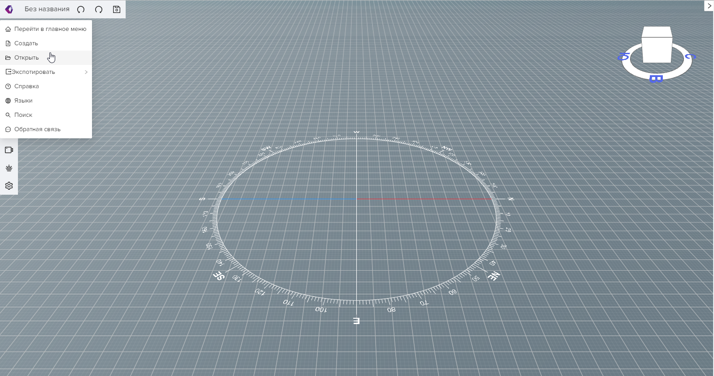
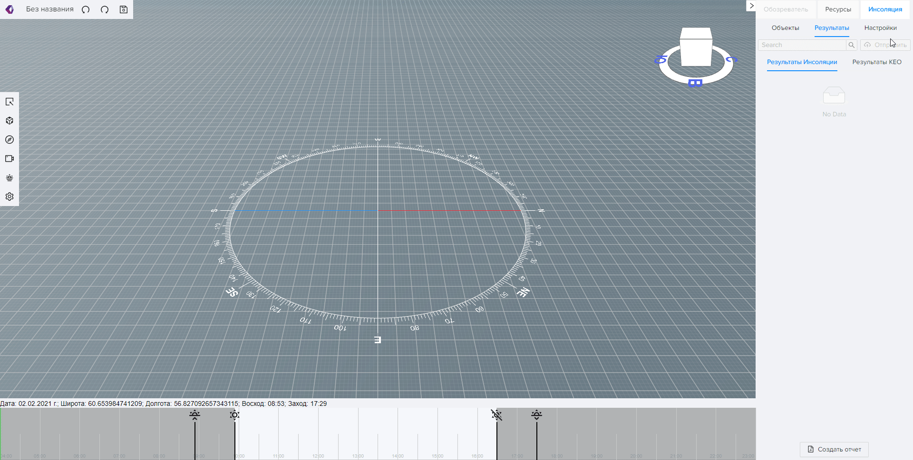

# Добро пожаловать!
***
## _Аltec Insolations_

```
Ваш инструмент для точного и быстрого анализа проекта. С помощью нашего сервиса Вы сможете рассчитать
продолжительность инсоляции, уровень естественной освещенности и шумозащиты в соответствии с нормативными 
требованиями. Это  краткое  руководство позволит Вам ознакомиться с этапами   работы нашего программного 
обеспечения и максимально эффективно использовать функционал программы. 

Хорошего чтения и приятного пользования!
```
import Tabs from '@theme/Tabs';
import TabItem from '@theme/TabItem';

## 1. Регистрация 
ссылка
## 2.Скачать плагин 
ссылка
## 3.Экспорт модели  
ссылка

В главном меню нажимаем на команду _“открыть”_, загружаем модель. Приближение и отдаление модели производится колесиком. Вращение осуществляется сочетанием зажатого колёсика и клавиши “Shift”. 



## 4.Задайте настройки расчета инсоляции
 ### <u> Местоположение </u>

    
Открываем вкладку настройки.  Можно указать **местоположение** участка застройки на карте, **широта** и **долгота** определяются автоматически. 
В параметрах расчета выставляем **дату**.



Расчет продолжительности инсоляции помещений на определенный период проводят на день начала периода или день его окончания для:

> - _ северной зоны (севернее 58° с.ш.) - 22 апреля или 22 августа;_
- _центральной зоны (58° с.ш. - 48° с.ш.) - 22 апреля или 22 августа;_
- _южной зоны (южнее 48° с.ш.) - 22 февраля или 22 октября._
  
Также для расчета нужно определить игнорируемое время инсоляции **после восхода** и **до захода**:
> - _ 1 ч для районов южнее 58° с.ш._ 
- _ 1,5 ч для районов севернее 58° с.ш._

### <u> Инсоляция окон </u>
Параметры инсоляции выставляем, руководствуясь нормативами: 

**Непрерывная:**
> - _для северной зоны (севернее 58° с.ш.) - не менее 2,5 часов в день_ 
- _для центральной зоны (58° с.ш. - 48° с.ш.) - не менее 2 часов в день_ 
- _для южной зоны (южнее 48° с.ш.) - не менее 1,5 часов в день_ 
  
**Прерывистая:**
> - _+ 0,5 часа соответственно для каждой зоны соответственно._

**Обязательная:**
> - _1,0 час для любой зоны._ 

### <u> Инсоляция площадок </u>

Параметры имеют следующие значения:
> - **Непрерывная:** _2,5 часа_
- **Прерывистая:** _2,5 часа_
- **Обязательная:** _1 час_
- **Инсолируемая часть:** _50%_
 
   *_независимо от географической широты_

## 5. Загружаем модель в сервис 
Переходим в раздел объекты. Если рассчитать нужно весь проект, используем кнопку **“отметить всё”**, для отмены подборки  **“снять всё”** . 


Анализировать можно отдельные здания, этажи, квартиры, помещения. Ставим галочки на нужные объекты. После осуществления выборки нажимаем **“начать расчет инсоляции”**.

#### Готово! 

## 6. Результаты 
 ### <u> Результаты инсоляции </u>
Переходим во вкладку **результаты**. Для каждой квартиры определяется цвет. 
 > _Красный_ - все помещения не прошли инсоляцию.  
 _Оранжевый_  - помещения частично не прошли инсоляцию.  
 _Зеленый_ - инсолируются все помещения. 

Развернем вкладку квартиры. Здесь информация о помещении, проценте непрерывной инсоляции, суммарной инсоляции. Нажмём на последнюю и во всплывающей таблице увидим начало, конец и продолжительность облучения солнечными лучами объекта. Информация дублируется на 
инсоляционной линейке и графически отображается на модели.

При нажатии на окно в модели можем увидеть линии построения, расчётную точку и инсоляционные лучи. Во вкладке объекты высветится номер окна и принадлежность его к определенной квартире этажу и зданию.
 
