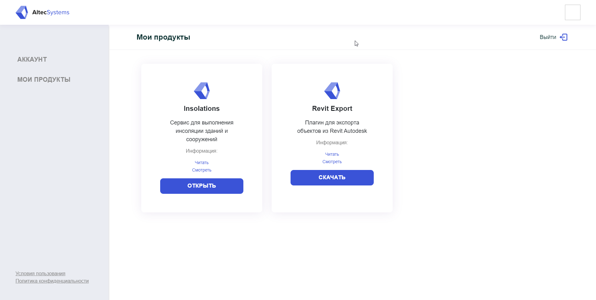
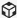
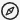
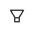
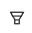
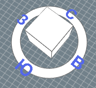
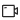
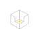
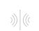
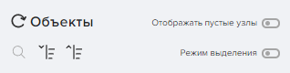

import rvImage from "./resources/rv.png";
import rvImage1 from "./resources/neopred.png";
import rvImage2 from "./resources/AVT.png";
import rvImage3 from "./resources/neopred.png";
import rvImage4 from "./resources/neopred.png";
import rvImage5 from "./resources/neopred.png";
import rvImage6 from "./resources/neopred.png";

***
#### *__Altec Insolations__ - это сервис, предназначенный для расчета инсоляции жилых и общественных зданий и автоматического формирования отчета. В разработке находится функционал по расчету КЕО и шумозащиты*

#### *Данное руководство - пошаговая инструкция, которая позволит Вам легко ориентироваться в интерфейсе программы, максимально эффективно использовать ее функционал и получать корректные результаты в соответствии с действующей нормативной документацией.*


# 1.Регистрация в ЛК

На данный момент регистрация осуществляется администраторами. Пользователю предоставляется ссылка на личный кабинет.

# 2. Плагин Revit Export
## 2.1.Установка плагина

Для расчета инсоляции в AltecInsolations Вам понадобится конвертировать модель в формат glb с помощью плагина **Revit Export**. Скачать плагин можно в личном кабинете AltecSystems во вкладке *"Мои продукты"*. 



Во время установки плагина программа Revit должна быть закрыта. 

Выберите версии Revit, с которыми вы будете работать и запустите установку.

В случае, если плагин уже установлен, Вы можете обновить его до последней версии, или удалить.

Откройте модель в Revit, перейдите на вкладку *AltecSystems Exporter*. 

Для корректных расчетов необходимо, чтобы на виде отображались основные конструкции здания и другие элементы, влияющие на расчет. Экспорту подлежат только видимые элементы текущего 3D вида.

Нажмите кнопку *“Создать вид”* на верхней панели команд. В проекте появится новый вид, именуемый *”AS_Export View”* в диспетчере проекта. 

Для автоматической настройки категорий можно воспользоваться кнопкой создания преднастроенного вида *"Создать вид"* на верхней панели. После вы получите оптимально настроенный 3D вид.


**Важно:**

Оптимальная настройка уровня детализации в Revit - "Средний".
Иногда в сцене присутствуют высокодетализированные элементы (большое количество полигонов, которые могут существенно замедлить экспорт или привести к ошибкам). Такие элементы, желательно, скрыть при экспорте.

*При ручной настройке обязательными к экспорту являются:* 

```
Балочные системы
Витражные системы
Двери
Импосты витража
Каркас несущий
Колонны
Крыши
Несущие колонны
Обобщенные модели
Окна
Ограждения
Панели витража
Перекрытия
Потолки
Стены
Фермы
Части
Соединение несущих конструкций
```

Когда создан 3D вид, можно приступать к экспорту.

## 2. 2. Экспорт модели. Требования к ней
	
Для вызова окна авторизации нажмите на кнопку *“Экспортер”* на верхней панели команд.
Нажимаем *“Войти”*, в окне авторизации вводим электронную почту и пароль. 


После авторизации вы попадаете в окно экспорта. 

В текущем окне три вкладки: *“Экспорт”, “Аккаунт”, “Информация”*.

> **“Экспорт”**
> 
> В поле *“Имя проекта”* Вы можете задать новое имя или оставить автоматически сгенерированное из наименования файла Revit.
>
> В выпадающем списке *“Проекты на сервере”* Вы можете выбрать имеющийся проект, в таком случае модель на сервере будет заменена на текущую версию.


> **“Аккаунт”**
>
> В информации об аккаунте Вы увидите данные, введенные на этапе авторизации.

> **“Информация”**
>
> В этой вкладке содержатся сведения об используемом плагине, контактная информация о разработчике.
>
> Для выгрузки файла в AltecInsolations нажимаем кнопку *“В Insolations”* на вкладке *“Экспорт”*. 
>
> После выгрузки вы увидите уведомление *“Экспорт завершен”*.


# 3. Сервис Altec Insolations  
## 3.1. Главная страница
Вы можете перейти в сервис AltecInsolations по прямой ссылке или из личного кабинета, вкладка *“Мои продукты”*.

На главной странице вы увидите тестовую модель и ранее экспортированные Вами файлы. 

Для навигации можно воспользоваться поиском по названию, выбрать удобный режим отображения: список или таблица. 


**Левая панель содержит:**


*Главная страница*


*Настройки*


*Справка*


*Личный кабинет*


При нажатии на иконку Вы можете открыть личный кабинет в новой вкладке или выйти из аккаунта.

Вы можете создать папку, используя кнопку *“Добавить папку”*. Файлы можно перемещать в папки с помощью перетаскивания или контекстного меню файла модели.

Открыть модель можно с помощью двойного клика левой кнопкой мыши (далее ЛКМ) или через контекстное меню - открыть.

## 3.2. Интерфейс программы

После загрузки сцены вы увидите интерфейс, который содержит:

```
Модель в сцене
Панель инструментов (в левой части экрана)
Командная панель (в правой части экрана)
Инсоляционная линейка (в нижней части экрана).
Панель инструментов
```

В верхней части панели расположен логотип, который содержит контекстное меню данной модели.

Иконка в виде домика возвращает на главную страницу.

**Инструменты:**
 
 *Сечение* позволяет изучить модель, планировки.


 Клик по иконке *“Роза компаса”*  позволяет отключать и включать розу ветров на виде. 

 
 Вы можете выбрать режим камеры при наведении на иконку. 


**Режимы камеры:**

 *“Орто камера”*
включает ортогональный вид на модель сверху

Перемещение по сцене осуществляется с помощью зажатия колесика мыши и перемещения курсора. Для приближения - отдаления прокручиваем колесико мыши.

 *“Арк камера”* 
активирует перспективу модели

В режиме “Арк камера” в главном видовом окне вращение модели осуществляется относительно центра (положения курсора) по сфере через одновременное зажатие колёсика мыши и клавиши “Shift”. Для смещения вправо-влево необходимо зажать колёсико мыши в любой точке и осуществить перемещение.  
В правом верхнем углу видовой куб, позволяющий осуществлять навигацию по модели. Можно менять видовые кадры, кликая левой кнопкой мыши либо по сторонам света, либо по граням и ребрам куба. 



 *“Свободная камера”* 
активирует перспективу модели

Режим “Свободная камера” подразумевает возможность полёта камеры отдельно от объекта. Поворот осуществляется с помощью зажатия колесика мыши. Движение вверх-вниз, вправо-влево осуществляется с помощью клавиш управления курсором (стрелок навигации).


**Командная панель:**

Содержит вкладки:


 
Дерево объектов (открыто по умолчанию)

 
Инсоляция окон

 
КЕО

 
Инсоляция площадок

 
Шумозащита

# 4. Расчет инсоляции.  
## 4.1. Настройки и расчёт

Дерево объектов содержит здания, уровни (этажи), квартиры, помещения и окна. 
Панель навигации по дереву объектов включает: поиск, кнопки свернуть и развернуть все, возможность скрыть пустые узлы (помещения без квартиры) и режим выделения (не активен по умолчанию).




*Для расчета инсоляции необходимо:*
1. Активировать режим выделения
2. Выбрать объекты для расчета автоматически  или вручную, пользуясь чекбоксами в дереве объектов.

Расчетной единицей может являться здание, этаж, квартира, помещение, окно.

После того как расчетные единицы выбраны, внизу панели появляются активные кнопки *“Расчет инсоляции”* и *“Расчет КЕО”* . 

Для корректного расчета инсоляции необходимо заполнить настройки. Для этого перейдите во вкладку *“Инсоляция”*, которая содержит настройки и результаты.


**Настройки инсоляции:**

В *режиме автозаполнения* укажите местоположение, открыв карту нажатием кнопки *“Указать место”*. Данные будут заполнены автоматически.

В случае, когда местоположение не содержит данные о городе вы увидите надпись:


Заполнить это поле можно нажав на ссылку.
Последующие строки заполняются автоматически в соответствии с СанПиН 1.2.3685 - 21 «Гигиенические нормативы и требования к обеспечению безопасности и (или) безвредности для человека факторов среды обитания».
При выборе *ручного режима*, программа выдаст предупреждение:


В отчете будет пометка, о том, что данные введены произвольно и необходима их проверка на соответствие СанПиН 1.2.3685 - 21
Заполняем все поля в соответствии с нормативом, либо вводим произвольные параметры. 
В нижней части командной модели есть опция *“Возврат точки”*. При включении активируется функционал перемещения расчетной точки на подоконник при условии, что она в связи с особенностям геометрии переместилась за пределы светопроема. 

Если же мы отключаем возврат, то можем сами назначить допустимую высоту смещения точки по горизонтали. 

Высота подоконника, определяет значение, на которое можно поднимать расчетную точку относительно подоконника (метры)

Убедившись в корректности введенных настроек, возвращаемся на вкладку *“Объекты”*	
Нажимаем *“Расчет инсоляции”*. Происходит загрузка модели, ее предварительная обработка, поиск расчётных точек, инсолирование выбранных объектов. Ход расчета отображается в нижней панели.

Возвращаемся на вкладку *“Инсоляция”*, переходим в раздел *Результаты*.

На панели отображается имя здания, ниже указывается его тип жилое/общественное далее списки зданий со вложенностями. Отображается процент непрерывной инсоляции и суммарной. При нажатии на последнюю выводятся время начала инсоляции, её конец им сумма. В нижней части экрана - инсоляционная линейка, на которой эта информация выведена графически. 

Зелёным отображаются объекты прошедшие инсоляцию, красным - соответственно не прошедшие инсоляцию.

В Верхней части панели есть фильтр, позволяющий отобразить только нужные для анализа планы и фильтр в зависимости от прохождения тем или иным помещением инсоляцию.

## 5.2 Отчет.  

В нижней части панели есть кнопка, позволяющая создать отчёт. Нажимаем. Появляется окно *“Формирование отчёта”*. Нам предлагается создать отчет по шаблону выбираем *“Инсоляция зданий”*. Нажимаем *“Создать”*

 ### 1 ШАГ

Заполняем строку *“Заголовок отчета”*
Вводим данные штампа. Есть возможность его редактирования путем добавления и удаления строк. Нажимаем *“Продолжить”*

### 2 ШАГ

Заполняем поле *“Введение”*. Текст можно сохранить как шаблон и использовать в последующих версиях отчета для текущей модели.

Далее описана методика расчета. Информация об исходных данных генерируется автоматически, изменить её можно в командном меню в разделе *“Настройки”*. Обновление настроек повлечет изменение результатов инсоляции в отчёте.

###  3 ШАГ

На этом этапе Вы выбираете необходимые для отчета этажи с помощью фильтра.

### 4 ШАГ

Заполняем поле *“Вывод”*. Текст можно сохранить как шаблон и использовать в последующих версиях отчета для текущей модели.

### 5 ШАГ

В автоматически сформированном списке объектов из файла RVT выбираем здание, этаж, либо группу этажей, для которых необходимо сгенерировать сечение.
Планы БТИ необходимо выгрузить самостоятельно, с помощью кнопки *“Добавить файл”*.


### 6 ШАГ

Ваш отчёт готов! На этом этапе доступно превью всего отчета, его можно сохранить для редактирования в сервисе. 

Отчет можно сохранить в PDF. Файл будет скачан и заверен электронной подписью, без дальнейшей возможности редактирования.


